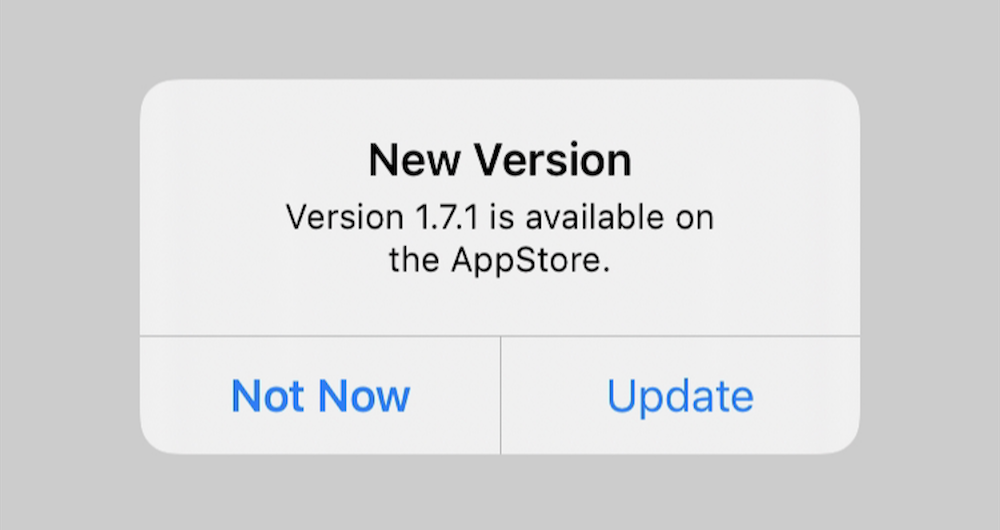

# YiAppUpdater

[](https://travis-ci.org/coderyi/YiAppUpdater)
[](https://cocoapods.org/pods/YiAppUpdater)
[](https://cocoapods.org/pods/YiAppUpdater)
[](https://cocoapods.org/pods/YiAppUpdater)

Checks if there is a newer version of your app in the AppStore and alerts the user to update.


## Installation

YiAppUpdater is available through [CocoaPods](https://cocoapods.org). To install
it, simply add the following line to your Podfile:

```ruby
pod 'YiAppUpdater'
```

## Usage

```
YiAppUpdater.shared.showUpdateWithConfirmation()
```



## Author

coderyi, coderyi@foxmail.com

## License

YiAppUpdater is available under the MIT license. See the LICENSE file for more info.
